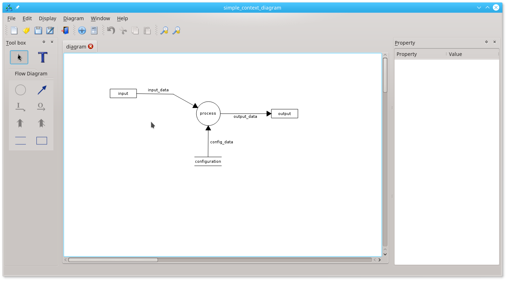

# graphia

Graphia is an application to build graphical diagram.

Today, it aims is to build SART diagram:
 - SART context diagram
 - SART diagram context

It provides also a model of the built diagram, in order to be able to simulate it.
 
## Screenshot of simple example

## development status

This application is still in development. Today, it ables to 
 - create SART context and process diagram
 - save the diagram
 - set process and data flow on it.
 
See the TODO file [TODO] for the list of next tasks.
Especially:
 - add Ctrl+Z feature
 - insert and control diagram coherency
 
 
